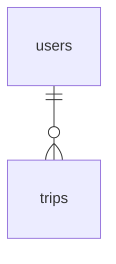
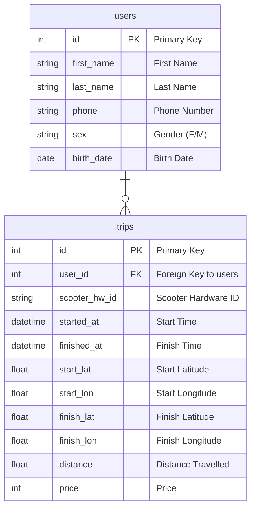
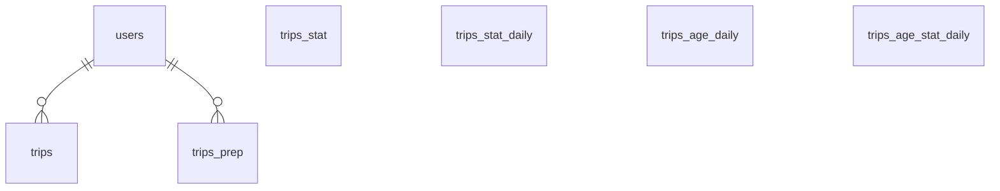
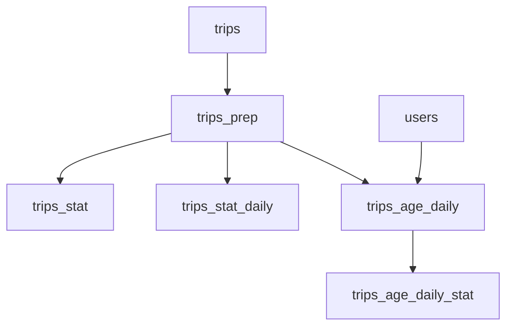
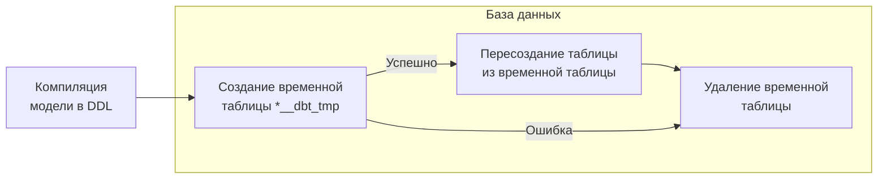
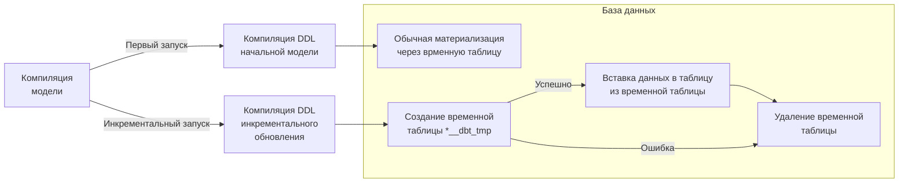

# SVG-файлы и диаграммы

## erd1

```mermaid
erDiagram
    users ||--o{ trips : ""
```

## erd2

```mermaid
erDiagram
    users {
        int id PK "Primary Key"
        string first_name "First Name"
        string last_name "Last Name"
        string phone "Phone Number"
        string sex "Gender (F/M)"
        date birth_date "Birth Date"
    }
    trips {
        int id PK "Primary Key"
        int user_id FK "Foreign Key to users"
        string scooter_hw_id "Scooter Hardware ID"
        datetime started_at "Start Time"
        datetime finished_at "Finish Time"
        float start_lat "Start Latitude"
        float start_lon "Start Longitude"
        float finish_lat "Finish Latitude"
        float finish_lon "Finish Longitude"
        float distance "Distance Travelled"
        int price "Price"
    }
    users ||--o{ trips : ""
```

## erd3

```mermaid
erDiagram
    users ||--o{ trips : ""
    users ||--o{ trips_prep : ""
    trips_stat
    trips_stat_daily
    trips_age_daily
    trips_age_stat_daily
```

## data_lineage

```mermaid
graph TD
    A[users]
    B[trips]
    B --> C[trips_prep]
    C --> D[trips_stat]
    C --> E[trips_stat_daily]
    A --> F[trips_age_daily]
    F --> G[trips_age_daily_stat]
    C --> F
```

## table workflow

```mermaid
graph LR
    A[Компиляция\nмодели в DDL]
    subgraph База данных
        B[Создание временной\nтаблицы *__dbt_tmp]
        C[Пересоздание таблицы\nиз временной таблицы]
        D[Удаление временной\nтаблицы]
    end
    A --> B -->|Успешно| C --> D
    B -->|Ошибка| D
```

## incremental table workflow

```mermaid
graph LR
    A[Компиляция\nмодели]
    A1[Компиляция DDL\nначальной модели]
    A2[Компиляция DDL\nинкрементального\nобновления]
    A --> |Первый запуск| A1
    A --> |Инкрементальный запуск| A2
    subgraph База данных
        M[Обычная материализация\nчерез врменную таблицу]
        B[Создание временной\nтаблицы *__dbt_tmp]
        C[Вставка данных в таблицу\nиз временной таблицы]
        D[Удаление временной\nтаблицы]
    end
    A1 --> M
    A2 --> B -->|Успешно| C --> D
    B -->|Ошибка| D
```
